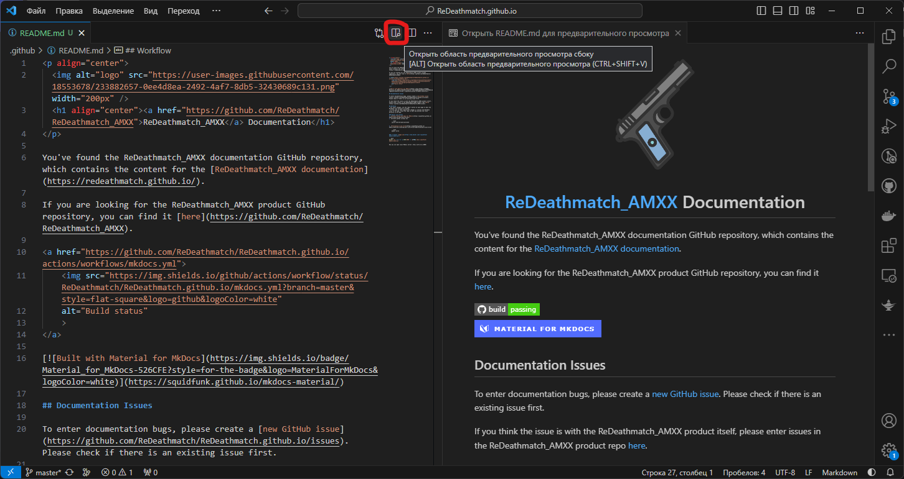

<p align="center">
    
    <h1 align="center">
        <a href="https://github.com/ReDeathmatch/ReDeathmatch_AMXX">
            ReDeathmatch_AMXX
        </a>
        Documentation
        <br>
        <a href="https://github.com/ReDeathmatch/ReDeathmatch.github.io/actions/workflows/mkdocs.yml">
            </a> 
        <a href="https://squidfunk.github.io/mkdocs-material/">
            </a> 
    </h1>
</p>

You've found the ReDeathmatch_AMXX documentation GitHub repository, which contains the content for the [ReDeathmatch_AMXX documentation](https://redeathmatch.github.io/).

If you are looking for the ReDeathmatch_AMXX product GitHub repository, you can find it [here](https://github.com/ReDeathmatch/ReDeathmatch_AMXX).

## Documentation Issues

To enter documentation bugs, please create a [new GitHub issue](https://github.com/ReDeathmatch/ReDeathmatch.github.io/issues). Please check if there is an existing issue first.

If you think the issue is with the ReDeathmatch_AMXX product itself, please enter issues in the ReDeathmatch_AMXX product repo [here](https://github.com/ReDeathmatch/ReDeathmatch_AMXX/issues).

## Workflow
- For small changes, use the "Edit" button on each page to edit the Markdown file directly on GitHub.
- If you plan to make significant changes or preview the Markdown files in VS Code, clone the repo to edit and preview the files directly in VS Code.


### Manual with Python
1. [Install Python and deps for MkDocs](https://squidfunk.github.io/mkdocs-material/getting-started/)
2. Activate python virtual env

    ```bash
    source venv/Scripts/activate
    ```

3. [Previewing as you write](https://squidfunk.github.io/mkdocs-material/creating-your-site/?h=serve#previewing-as-you-write)

    ```bash
    mkdocs serve
    ```

### or Docker [image use](https://hub.docker.com/r/squidfunk/mkdocs-material/)

```bash
docker run --rm -it -p 8000:8000 -v /${PWD}:/docs squidfunk/mkdocs-material
```

Now you can open local MkDocs server: http://127.0.0.1:8000/