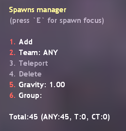
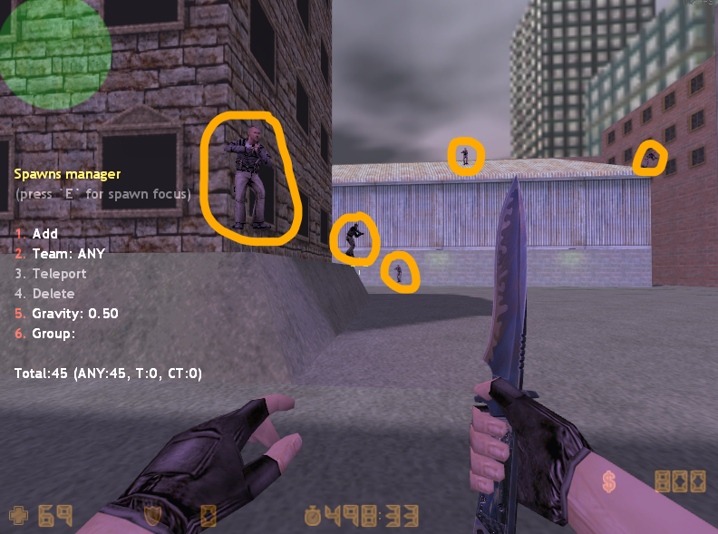

## Editing Respawn Configurations with ReDeathmatch

ReDeathmatch has a built-in editor for editing respawn configurations. This editor can be accessed by using a command with the necessary permissions (by default, the `f` flag) on behalf of the player.

When the editing mode is activated, the spawn point configuration file is loaded into the system's memory, and all further interactions happen ONLY with the virtual object. Once the editing of the respawn points is completed, the virtual object overwrites the configuration file with the new respawn configuration.

### Enabling Editing

To call the respawn editor menu, use the following command:
```js
redm_edit_spawns
```

Upon successful execution of the command, the following will happen:

1) The admin menu will be displayed to the player:



2) If any spawn points already exist in the configuration files, they will be displayed:



In case of any errors, the system will notify them in the server console or player console, as well as through an informational message in the chat.

### Disabling Editing
Disabling the respawn editing system is done with the same command used for enabling it:
```js
redm_edit_spawns
```

Disabling the spawn editor menu will hide the spawn points and overwrite the spawn configuration file.