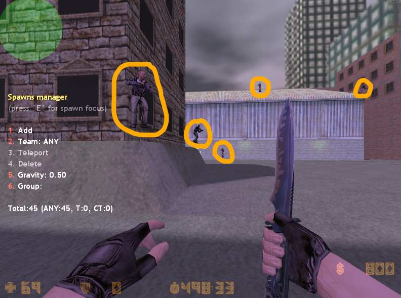

ReDeathmatch имеет встроенный редактор respawn-конфигураций вызываемой командой от имени игрока с необходимыми правами (по умолчанию `f` флаг) для использования команды.

При активации редактирования файл с конфигурацией spawn-точек считывается в память системы, и дальнейшее взаимодействие происходит ТОЛЬКО с виртуальным объектом. По окончанию работы с respawn-точками виртуальный объект перезаписывает файл с новой respawn-конфигурацией.

## Включение редактирования

Команда для вызова меню редакторирования респавнов:
```js
redm_edit_spawns
```

Успешное выполнение команды:

1) Покажет игроку-администратору меню:


2) Включит отображение точек, если таковые уже имеются в конфигурационных файлах:




В случае возникновения ошибок система оповестит в консоли сервера или консоли игрока, а так же в чате информационным сообщением.

## Выключение редактирования
Выключение системы редактирования спавнов происходит той же командой, что и включения:
```js
redm_edit_spawns
```

Меню редактирования спавнов выключается, отключается видимость спавн-точек, а так же происходит перезапись файла конфигурации spawn-точек.
